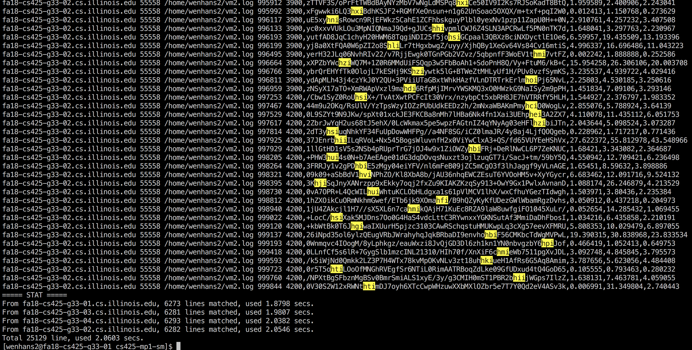

# cs425-mp1-sm

Repo for CS425 MP1

# Usage

## Server
```bash
$ python3 server.py
```

## Client
```bash
$ python3 client.py "YOUR_PATTERN"
```

Note: The input pattern can be a raw string (e.g. `a`, `abc`, `hello`)
or a regex (e.g. `a[a-z]b`, `a?`). For the regex input, the rule is the
same as `re.py` package for Python.

# Demo

Here is demo that query regex pattern `h[a-z]i` from 4 different VMs.

- wenhans2@fa18-cs425-g33-01.cs.illinois. (where we also run `client.py`)
- wenhans2@fa18-cs425-g33-02.cs.illinois.edu
- wenhans2@fa18-cs425-g33-03.cs.illinois.edu
- wenhans2@fa18-cs425-g33-04.cs.illinois.edu

We do not run any server (`server.py`) on the other remaining 6 VMs.

- wenhans2@fa18-cs425-g33-05.cs.illinois.edu
- wenhans2@fa18-cs425-g33-06.cs.illinois.edu
- wenhans2@fa18-cs425-g33-07.cs.illinois.edu
- wenhans2@fa18-cs425-g33-08.cs.illinois.edu
- wenhans2@fa18-cs425-g33-09.cs.illinois.edu
- wenhans2@fa18-cs425-g33-10.cs.illinois.edu



The result shows the matched lines from each VM time cost for each thread worker, total lines and time cost.

# Developers
- [Wenhan Shi](mailto:wenhans2@illinois.edu)
- [Linling Miao](mailto:lmiao@illinois.edu)


# Misc

Have fun with Covfefe! Inc.
